MemTrace
========

MemTrace is a memory debugging tool developed internally at Insomniac Games.
It has been used in production at the studio since 2014 and is now relatively
stable.

Features
--------

- Lightweight C++ runtime component with network recording
- CRT heap hooking on Windows (Durango hooking available on request to licensed devs)
- Full support for custom heaps and allocators
- Supports displaying and analyzing fragmentation for custom heaps
- Can display a delta between two arbitrary points in time.
- Can aggregate memory data along several axes, including custom scopes
- Supports asset and component memory scoping out of the box, but can be
  extended in source to group on arbitrary scopes
- Supports forward and backward scrubbing in trace files during analysis

Using the Tool
--------------

The GUI tool uses memory mapped files and is capable of analyzing very
large trace files (larger than available memory). For best results you should
run it on a 64-bit version of Windows. The tool is based on stream replaying,
quickly moving back and forth between points in time to present a snapshot of
what memory looked like at that exact time. User marks can be used to name a
particular point in time, but you can also jump to an arbitrary point in time
by simply entering a time in seconds.

Captured trace files are standalone (after symbol resolving) and can be sent
off to someone else for analysis without access to the client program or its
symbol data. This also means you can archive them for future reference to see
how a program's behavior has evolved over time. To load a received trace file
simply copy it in to your configured trace directory and it will appear in the
UI for selection.

### Capturing Trace Files ###

Upon starting the tool, it will accept incoming connections and start recording
data. The main window shows statistics about the trace files being recorded.

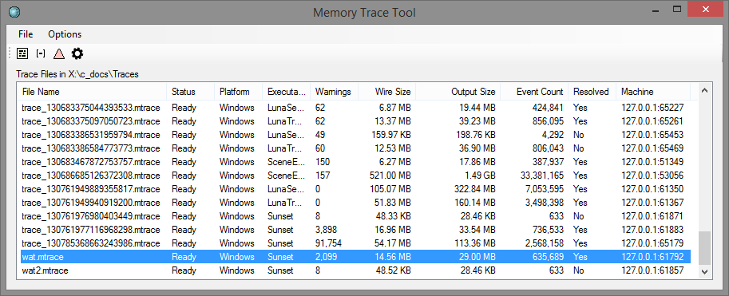

There is no limit to the number of files that can be concurrently recorded.
You may record and analyze traces at the same time if desired.

A trace may be stopped from the UI by right clicking it and selecting "Stop".

Traces are named automatically, but may be renamed by double clicking the
filename (or hitting F2) and typing in a replacement name.

Marks may be inserted into a running trace by right-clicking the trace file and
selecting "User Trace Mark". This is useful in cases where the client doesn't
have a UI or other logic that allows you to set a trace mark in some other way.
Marks created in this way will be named "UI Mark N", so they're not super
descriptive, but nevertheless useful.

### Resolving Symbols ###

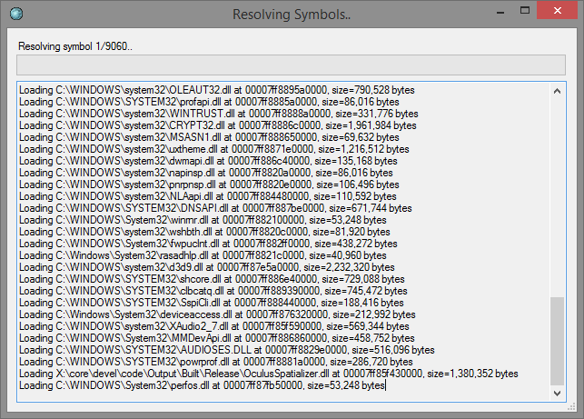

With a completed trace file selected, click the little gear icon to bring up
the symbol resolver. This will resolve symbols using the symbol options and
store any resolved data back to the trace file. When the resolution has finished,
just close the window.

### Inspecting Memory State ###

With a completed trace file selected (preferably with symbols resolved if you
want to make any sense of it!) click the heap view icon to bring up the heap
visualizer.

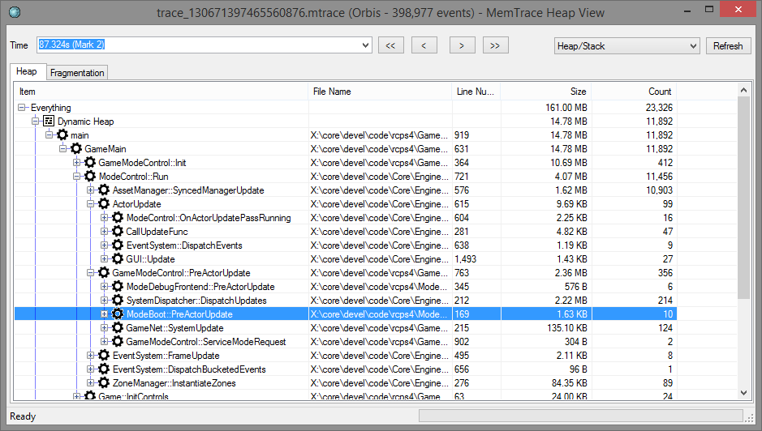

In this window you can scrub the time back and forth to inspect the state of
all heaps and allocators at that time. Marks are handy here as a shortcut to
guide you to a point of interest, but you can pick an arbitrary point as well.

The tree view is populated with an aggregate view based on the current
perspective. By default the view aggregates all allocations by heap/allocator
and then by call stack. You can sort by any columns (although the UI is
a little rough when scrubbing and can require a nudge to re-sort the data).

By using the perspective dropdown you to switch to a different perspective.
For example, you can reverse all call stacks to answer questions such as "who
calls this allocator", or "who brought this asset in". Using the asset or
component perspectives requires instrumenting your code appropriately with
scopes.

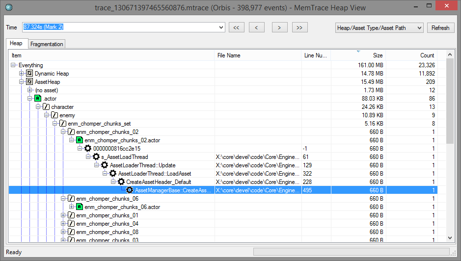

#### Fragmentation ####

The heap visualizer can display fragmentation data for a memory range. Switch
to the Fragmentation tab and select a memory range. The dots indicate how well
each block is filled. Selecting a block shows a breakdown of what was in the
block at the selected time. Selecting an allocations shows the callstack of the
originating code that cause the allocation. The allocations also show the
relative age.

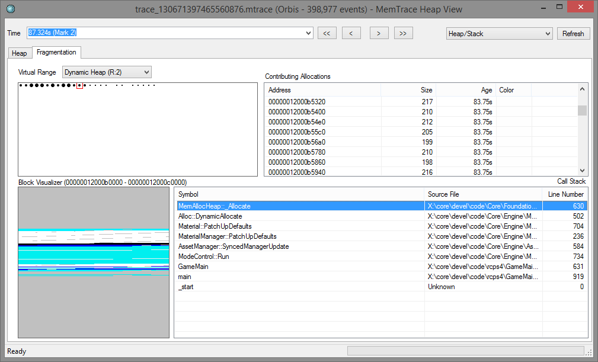

### Inspecting Memory Deltas ###

The delta view is similar to the basic heap view, but will show you what was
allocated between two points in time, but not freed. It's an excellent tool to
track down memory leaks between levels in a level-based game for example.

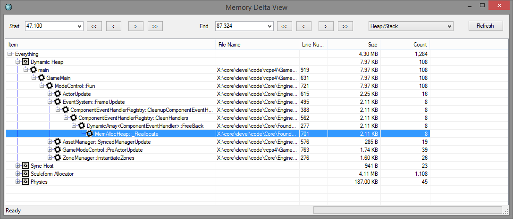

### Searching for Allocation Owners ###

This is a specialized tool that will show all callstacks that lead to a
particular range in memory being allocated. It is sometimes useful to be able
to track down who previously owned a piece of memory that is involved in a
memory overwrite.

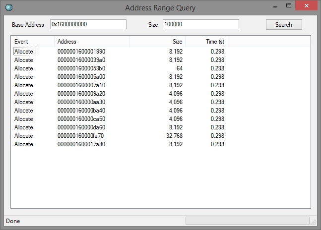

Input the address range you're interested in and search. You'll see a list of
allocations that overlapped that range, sorted by lifetime. You can hover an
item to see the full callstack that allocated or freed a memory block.

### Options ###

This section goes over some of the configurable options of MemTrace. Options
are persisted in the registry. On first start, a default set of options are
read from a JSON file next to the executable and thrown in the registry.

If you're deploying the tool you can edit that JSON file and check it in
alongside the tool.

#### Symbol Suppression ####

The symbol suppressions dialog gives you a way to discard symbols from stack
traces. It's handy to remove noise from symbols that are present in every
stack, or otherwise superfluous.

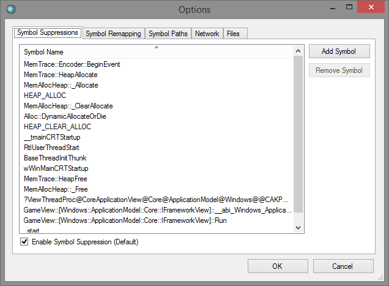

#### Symbol Remapping ####

The symbol remapping dialog gives you a way to remap search paths. This is most
useful for console targets.

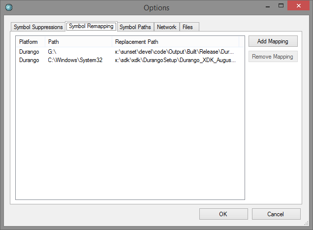

#### Symbol Paths ####

The symbol paths dialog gives you a way to specify search paths for symbol
files. This is useful for the Windows symbol resolver.

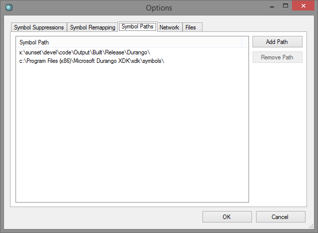

#### Network ####

This dialog allows you to change the default binding IP address and listening
port for the tool.

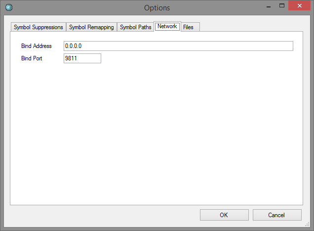

#### Files ####

This dialog allows you to set the directory where trace files are read from and
written to. It's the only mandatory thing you need to configure, and you'll be
presented with it when you start the tool the first time.

## Integrating MemTrace ##

Here are the basic steps needed to integrate MemTrace into your application:

0. Run the following commands to download the minhook headers for Windows builds:

        git submodule init
        git submodule checkout

1. Add the client component source code to your app.

2. Instrument any custom heaps and allocators using the MemTrace API.

3. Start the client component extremely early (before all static initializers ideally).

4. If you want to hook CRT allocations, move the `MinHook.x64.dll` DLL next to your executable.

5. Build & run the graphical tool which is also the network listener.

6. Run your program; it will connect to the tool. Your data is now being captured live.

7. As the capture is running, you can mark points of interest using marks;
   either from the client API or from the UI.

8. When you've captured what you're interested in, resolve symbols and open the
   trace in one of the available analyzers.

## Using the API ##

### Initialization and Shutdown ###

Initialization is handled by `MemTrace::InitSocket`. On certain targets it
might not be possible to connect to the server as early in the startup flow as
is needed. For these circumstances you can use `MemTrace::InitFile` to begin
recording data to a file. When you later call `MemTrace::InitSocket` the file
will be uploaded to the server and deleted.

To shut down MemTrace, call `MemTrace::Shutdown`. This is not strictly required
but allows the UI to see a proper end of stream.

To mark a point of interest, call `MemTrace::UserMark` with a string label.
This label, along with the current time, will be available for selection in the
UI as a reference point. It's a bad idea to generate too many as they just
appear in a flat combo box, but a couple of dozen should be fine. For example
it might be a good idea to generate marks when loading and unloading a level in
your app.

### Instrumenting Custom Allocators ###

Start off by grabbing an identifier for your allocator:

    MemTrace::HeapId heapid = MemTrace::HeapCreate("my allocator");

You must then inform the tracer about any memory ranges assigned to or removed
from your allocator. This step is not strictly required but if you omit this
step the tool won't be able to display fragmentation data. You can add any
number of ranges during the lifetime of the allocator, it's not required to
stay static.

    MemTrace::HeapAddCore(heapid, mem_block1, block_size1);
    MemTrace::HeapAddCore(heapid, mem_blockN, block_sizeN);

    // later..
    MemTrace::HeapRemoveCore(heapid, mem_block1, block_size1);
    MemTrace::HeapRemoveCore(heapid, mem_blockN, block_sizeN);

Finally you tell the API about allocations in your allocator:

    MemTrace::HeapAllocate(heapid, ptr, size);
    MemTrace::HeapReallocate(heapid, ptr_in, ptr_out, new_size);
    MemTrace::HeapFree(heapid, ptr);

When an allocator is destroyed, you tell the API about it:

    MemTrace::HeapDestroy(heapid);

## Author ##

MemTrace was written by Andreas Fredriksson (@deplinenoise on Twitter).

## License ##

Copyright (c) 2015, Insomniac Games All rights reserved.

Redistribution and use in source and binary forms, with or without
modification, are permitted provided that the following conditions are met:

Redistributions of source code must retain the above copyright notice, this
list of conditions and the following disclaimer.

Redistributions in binary form must reproduce the above copyright notice, this
list of conditions and the following disclaimer in the documentation and/or
other materials provided with the distribution.

THIS SOFTWARE IS PROVIDED BY THE COPYRIGHT HOLDERS AND CONTRIBUTORS "AS IS" AND
ANY EXPRESS OR IMPLIED WARRANTIES, INCLUDING, BUT NOT LIMITED TO, THE IMPLIED
WARRANTIES OF MERCHANTABILITY AND FITNESS FOR A PARTICULAR PURPOSE ARE
DISCLAIMED. IN NO EVENT SHALL THE COPYRIGHT HOLDER OR CONTRIBUTORS BE LIABLE
FOR ANY DIRECT, INDIRECT, INCIDENTAL, SPECIAL, EXEMPLARY, OR CONSEQUENTIAL
DAMAGES (INCLUDING, BUT NOT LIMITED TO, PROCUREMENT OF SUBSTITUTE GOODS OR
SERVICES; LOSS OF USE, DATA, OR PROFITS; OR BUSINESS INTERRUPTION) HOWEVER
CAUSED AND ON ANY THEORY OF LIABILITY, WHETHER IN CONTRACT, STRICT LIABILITY,
OR TORT (INCLUDING NEGLIGENCE OR OTHERWISE) ARISING IN ANY WAY OUT OF THE USE
OF THIS SOFTWARE, EVEN IF ADVISED OF THE POSSIBILITY OF SUCH DAMAGE.

## Third-party software ##

MemTrace optionally uses the [MinHook](https://github.com/TsudaKageyu/minhook
"TsudaKageyu/minhook") library to capture CRT allocations on Windows. A minhook
DLL has been included with the git repository for convenience.

The license for MinHook follows.

    MinHook - The Minimalistic API Hooking Library for x64/x86
    Copyright (C) 2009-2015 Tsuda Kageyu.
    All rights reserved.

    Redistribution and use in source and binary forms, with or without
    modification, are permitted provided that the following conditions
    are met:

     1. Redistributions of source code must retain the above copyright
        notice, this list of conditions and the following disclaimer.
     2. Redistributions in binary form must reproduce the above copyright
        notice, this list of conditions and the following disclaimer in the
        documentation and/or other materials provided with the distribution.

    THIS SOFTWARE IS PROVIDED BY THE COPYRIGHT HOLDERS AND CONTRIBUTORS
    "AS IS" AND ANY EXPRESS OR IMPLIED WARRANTIES, INCLUDING, BUT NOT LIMITED
    TO, THE IMPLIED WARRANTIES OF MERCHANTABILITY AND FITNESS FOR A
    PARTICULAR PURPOSE ARE DISCLAIMED. IN NO EVENT SHALL THE COPYRIGHT HOLDER
    OR CONTRIBUTORS BE LIABLE FOR ANY DIRECT, INDIRECT, INCIDENTAL, SPECIAL,
    EXEMPLARY, OR CONSEQUENTIAL DAMAGES (INCLUDING, BUT NOT LIMITED TO,
    PROCUREMENT OF SUBSTITUTE GOODS OR SERVICES; LOSS OF USE, DATA, OR
    PROFITS; OR BUSINESS INTERRUPTION) HOWEVER CAUSED AND ON ANY THEORY OF
    LIABILITY, WHETHER IN CONTRACT, STRICT LIABILITY, OR TORT (INCLUDING
    NEGLIGENCE OR OTHERWISE) ARISING IN ANY WAY OUT OF THE USE OF THIS
    SOFTWARE, EVEN IF ADVISED OF THE POSSIBILITY OF SUCH DAMAGE.

    ================================================================================
    Portions of this software are Copyright (c) 2008-2009, Vyacheslav Patkov.
    ================================================================================
    Hacker Disassembler Engine 32 C
    Copyright (c) 2008-2009, Vyacheslav Patkov.
    All rights reserved.

    Redistribution and use in source and binary forms, with or without
    modification, are permitted provided that the following conditions
    are met:

     1. Redistributions of source code must retain the above copyright
        notice, this list of conditions and the following disclaimer.
     2. Redistributions in binary form must reproduce the above copyright
        notice, this list of conditions and the following disclaimer in the
        documentation and/or other materials provided with the distribution.

    THIS SOFTWARE IS PROVIDED BY THE COPYRIGHT HOLDERS AND CONTRIBUTORS
    "AS IS" AND ANY EXPRESS OR IMPLIED WARRANTIES, INCLUDING, BUT NOT LIMITED
    TO, THE IMPLIED WARRANTIES OF MERCHANTABILITY AND FITNESS FOR A
    PARTICULAR PURPOSE ARE DISCLAIMED. IN NO EVENT SHALL THE REGENTS OR
    CONTRIBUTORS BE LIABLE FOR ANY DIRECT, INDIRECT, INCIDENTAL, SPECIAL,
    EXEMPLARY, OR CONSEQUENTIAL DAMAGES (INCLUDING, BUT NOT LIMITED TO,
    PROCUREMENT OF SUBSTITUTE GOODS OR SERVICES; LOSS OF USE, DATA, OR
    PROFITS; OR BUSINESS INTERRUPTION) HOWEVER CAUSED AND ON ANY THEORY OF
    LIABILITY, WHETHER IN CONTRACT, STRICT LIABILITY, OR TORT (INCLUDING
    NEGLIGENCE OR OTHERWISE) ARISING IN ANY WAY OUT OF THE USE OF THIS
    SOFTWARE, EVEN IF ADVISED OF THE POSSIBILITY OF SUCH DAMAGE.

    -------------------------------------------------------------------------------
    Hacker Disassembler Engine 64 C
    Copyright (c) 2008-2009, Vyacheslav Patkov.
    All rights reserved.

    Redistribution and use in source and binary forms, with or without
    modification, are permitted provided that the following conditions
    are met:

     1. Redistributions of source code must retain the above copyright
        notice, this list of conditions and the following disclaimer.
     2. Redistributions in binary form must reproduce the above copyright
        notice, this list of conditions and the following disclaimer in the
        documentation and/or other materials provided with the distribution.

    THIS SOFTWARE IS PROVIDED BY THE COPYRIGHT HOLDERS AND CONTRIBUTORS
    "AS IS" AND ANY EXPRESS OR IMPLIED WARRANTIES, INCLUDING, BUT NOT LIMITED
    TO, THE IMPLIED WARRANTIES OF MERCHANTABILITY AND FITNESS FOR A
    PARTICULAR PURPOSE ARE DISCLAIMED. IN NO EVENT SHALL THE REGENTS OR
    CONTRIBUTORS BE LIABLE FOR ANY DIRECT, INDIRECT, INCIDENTAL, SPECIAL,
    EXEMPLARY, OR CONSEQUENTIAL DAMAGES (INCLUDING, BUT NOT LIMITED TO,
    PROCUREMENT OF SUBSTITUTE GOODS OR SERVICES; LOSS OF USE, DATA, OR
    PROFITS; OR BUSINESS INTERRUPTION) HOWEVER CAUSED AND ON ANY THEORY OF
    LIABILITY, WHETHER IN CONTRACT, STRICT LIABILITY, OR TORT (INCLUDING
    NEGLIGENCE OR OTHERWISE) ARISING IN ANY WAY OUT OF THE USE OF THIS
    SOFTWARE, EVEN IF ADVISED OF THE POSSIBILITY OF SUCH DAMAGE.
